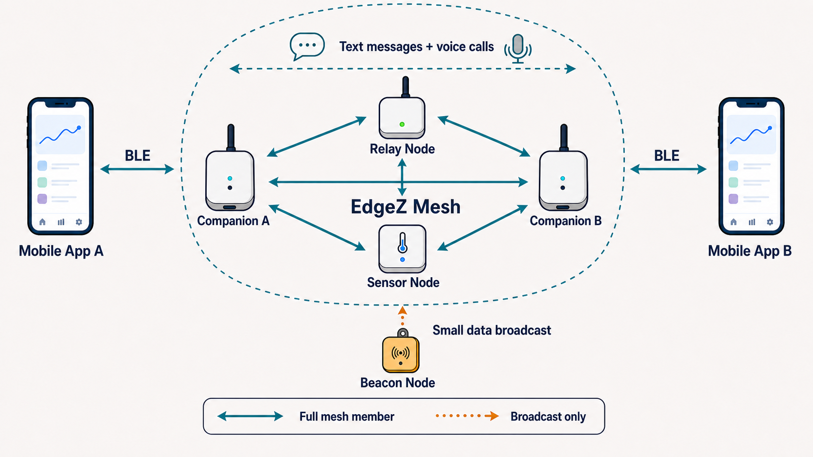

# Feature guide

The SDK owns the BLE transport and EdgeZ mesh protocol boundary. The host app
owns presentation, long-term application data, remote HTTP calls, and product
policy.

## Topology model

- **Text messages** — exchange encrypted peer-to-peer conversations across the
  mesh with delivery acknowledgements.
- **Voice messages** — record, send, receive, and replay encrypted audio
  messages.
- **Binary data** — carry compact device and sensor payloads across the mesh.
- **Voice calls** — stream encrypted, bidirectional live audio between mesh
  participants.
- **Sensor telemetry** — collect location, environmental, vibration,
  accelerometer, gyroscope, and custom binary sensor measurements.
- **Geo fences** — associate nodes with named geographic areas and alert
  conditions.

### Coming soon

- **Offline maps** — view cached maps, node locations, geo fences, and mesh
  topology without an internet connection.
- **Mixed mesh over libp2p** — connect eligible EdgeZ mesh gateways across
  network boundaries while preserving local offline operation.

See the [roadmap](roadmap.md) for the proposed scope and delivery phases.

Each Mobile App controls and observes the mesh through a BLE connection to its
Companion. Companion A, Companion B, the Relay Node, and the Sensor Node are
full mesh participants, allowing text messages and voice calls to travel
between the two applications. A Beacon Node does not join or route within the
mesh; it only broadcasts a small data payload for nearby mesh members to
receive.

## Capability matrix

| Capability | SDK surface | Example reference | Notes |
| --- | --- | --- | --- |
| BLE discovery and connection | `EdgezMeshSession.startBleScan`, `connectBle`, `disconnect` | [`app.dart`](../example/lib/src/app.dart), [`settings_tab.dart`](../example/lib/src/settings_tab.dart) | Discovered devices appear in `state.bleDevices`. |
| Mesh initialization | `initializeMesh(EdgezMeshConfig)` | [`app.dart`](../example/lib/src/app.dart) | The session remembers config and sends it when the native BLE service reports ready. |
| Identity and keys | `EdgezIdentityStore` | [`app.dart`](../example/lib/src/app.dart) | Creates and persists an X25519-compatible identity and supports key regeneration. |
| Mesh and license status | `state.status`, `state.bleReady` | [`shared_widgets.dart`](../example/lib/src/shared_widgets.dart) | Includes link readiness, firmware version, local MAC, and license state. |
| Node discovery | `state.nodes`, `state.sortedNodes` | [`nodes_tab.dart`](../example/lib/src/nodes_tab.dart) | Beacon data includes identity, marker, device type, location, and public key when available. |
| Sensor telemetry | `state.sensorSamples` | [`device_detail_screen.dart`](../example/lib/src/device_detail_screen.dart), [`dashboard_tab.dart`](../example/lib/src/dashboard_tab.dart) | Supports location, environmental, vibration, accelerometer, gyroscope, and binary-length values. |
| Topology | `state.topologyLinks` | [`topology_screen.dart`](../example/lib/src/topology_screen.dart) | Links expose reporter, peer, last-seen time, and decoded RSSI. |
| Encrypted text messaging | `sendTextMessage` | [`conversation_screen.dart`](../example/lib/src/conversation_screen.dart) | Conversation peers need a public key; delivery acknowledgements update message state. |
| Encrypted voice messages | `startVoiceMessage`, `finishVoiceMessage`, `playVoiceMessage` | [`conversation_screen.dart`](../example/lib/src/conversation_screen.dart) | Recording and playback are provided by the Android plugin. |
| Live voice calls | `startVoiceCall`, `acceptVoiceCall`, `endVoiceCall` | [`conversation_screen.dart`](../example/lib/src/conversation_screen.dart) | Call signaling and audio frames travel over the mesh. |
| Device provisioning | `authorizeSession`, `requestDeviceSettings`, `sendDeviceSettings` | [`provisioning_screen.dart`](../example/lib/src/provisioning_screen.dart) | The example implements an eight-step flow and blocks rejected licenses. |
| Sensor drivers | `EdgezDriverStore`, `sendDeviceSettings(... scripts:)` | [`driver_catalog.dart`](../example/lib/src/driver_catalog.dart), [`drivers_tab.dart`](../example/lib/src/drivers_tab.dart) | SDK storage validates bundles; the host resolves and downloads marketplace content. |
| Firmware OTA | `isOtaReady`, `performOta`, `abortOta` | [`app.dart`](../example/lib/src/app.dart), [`settings_tab.dart`](../example/lib/src/settings_tab.dart) | Host fetches and validates the manifest/image; SDK performs acknowledged BLE transfer and reports progress. |
| Cached app data | `restoreCachedMeshData` | [`example_database.dart`](../example/lib/src/example_database.dart) | The example persists nodes, messages, sensor samples, geofences, and dashboard choices in SQLite. Persistence is not part of the SDK. |
| Testable transport | `EdgezPlatformTransport` | [`mock_ble_transport.dart`](../test/support/mock_ble_transport.dart) | Inject a fake transport into `EdgezMeshSdk`, then pass it to `EdgezMeshSession`. |

## State model

`EdgezMeshSession` is a `ChangeNotifier`. A listener reads a complete immutable
snapshot from `session.state`:

- `connection`, `bleReady`, `status`, and `statusLine` describe connectivity.
- `bleDevices` contains scan results.
- `nodes`, `sensorSamples`, and `topologyLinks` describe the discovered mesh.
- `conversations` and `voiceCall` describe peer communication.
- `otaReady`, `otaInProgress`, and `otaProgress` describe firmware updates.
- `deviceSettings` is populated during provisioning.

Collections exposed by the state are unmodifiable. Persist or derive data from
the latest snapshot rather than mutating it.

## Security boundaries

- Text, voice messages, and live voice frames use peer identity keys in the SDK.
- The private identity key is stored by `EdgezIdentityStore` using
  `shared_preferences`. Review whether platform-backed secure storage is needed
  for your threat model before production deployment.
- A signed SDK release credential is attached to authorization and mesh
  initialization. Applications should use the credential bundled with the SDK;
  the signing private key must never ship in an app.
- Marketplace URLs, response identity, bundle fields, and HTTPS images are
  validated by the example host code before a bundle reaches `EdgezDriverStore`.

## Deliberate boundaries

The SDK does not provide screens, HTTP clients, a database, a map, or a backend.
The example demonstrates one possible UI and persistence architecture. Copy the
integration pattern, not necessarily its product-level design.

Offline maps and libp2p cross-boundary mixed-mesh connectivity are planned, but
are not current SDK capabilities. See the [roadmap](roadmap.md) for the proposed
scope and delivery phases.
